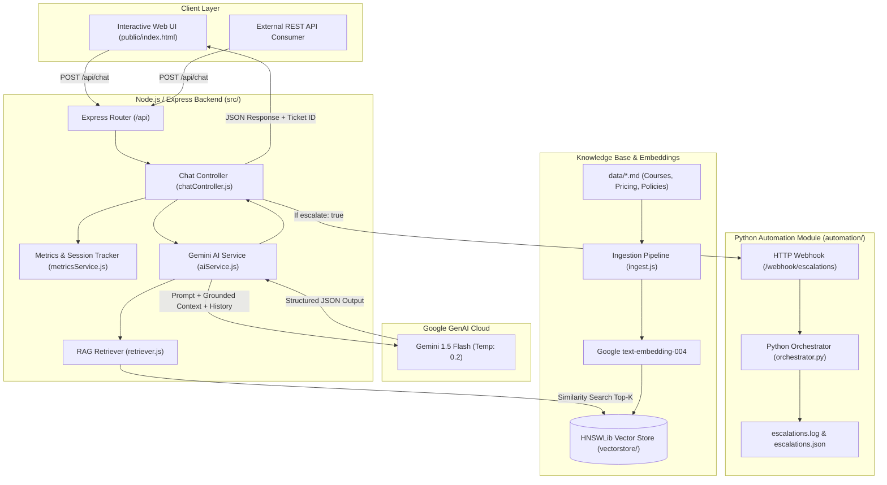

# Admissions RAG AI - Colombia Language Academy Assistant

An enterprise-grade, intelligent customer support and admissions assistant engineered for **Colombia Language Academy** (Academia de Idiomas Colombia). The system leverages **Node.js (ES Modules)**, **Google Gemini API** (`gemini-1.5-flash` & `text-embedding-004`) via **LangChain**, a local **HNSWLib** vector database for grounded Retrieval-Augmented Generation (RAG), a responsive **English Web Interface**, and an automated **Python Orchestrator** for human escalation alert dispatch.

---

## 🏛️ System Architecture



---

## 📁 Project Structure

```text
admissions-rag-ai/
├── automation/                          # Python automation & webhook orchestrator
│   ├── orchestrator.py                  # HTTP server, batch simulator & escalation logger
│   ├── requirements.txt                 # Python dependencies (requests, google-genai, python-dotenv)
│   ├── escalations.log                  # Live human escalation log
│   └── escalations.json                 # Structured JSON database of escalation tickets
├── data/                                # Business Knowledge Base Source Documents
│   ├── certifications_and_policies.md   # Official certs, grading, attendance, escalation info
│   ├── courses_and_levels.md            # Languages, CEFR levels A1-C1, modalities, schedules
│   └── pricing_and_enrollment.md        # Tuition in COP, discounts, payment methods, refund policies
├── public/                              # Responsive Web Frontend (English)
│   ├── index.html                       # Chat workspace and metrics dashboard
│   ├── style.css                        # Modern styling, animations, and dark slate palette
│   └── app.js                           # Real-time chat client, markdown parser, metrics poller
├── src/                                 # Node.js Application Source
│   ├── config/
│   │   └── env.js                       # Environment validation and config loader
│   ├── controllers/
│   │   └── chatController.js            # Chat, metrics, and ingestion request handlers
│   ├── rag/
│   │   ├── ingest.js                    # Document loader, recursive chunking & vector indexing
│   │   └── retriever.js                 # HNSWLib vector store loader & top-K similarity search
│   ├── routes/
│   │   └── api.js                       # Express API routing definitions
│   ├── services/
│   │   ├── aiService.js                 # Gemini Chat model, system prompt, few-shots & guardrails
│   │   └── metricsService.js            # Telemetry, token estimator & session history tracker
│   └── index.js                         # Express server entrypoint
├── vectorstore/                         # Persisted HNSWLib vector index files
├── .env.example                         # Environment variables template
├── .gitignore                           # Git ignore definitions
└── package.json                         # Node.js dependencies and run scripts
```

---

## 🚀 Setup & Installation Guide

### Prerequisites
- **Node.js**: v18.0.0 or higher (v20+ recommended)
- **Python**: v3.10 or higher
- **Google Gemini API Key**: [Get a Gemini API Key](https://aistudio.google.com/)

---

### Step 1: Clone & Install Node.js Dependencies

```bash
cd admissions-rag-ai
npm install
```

---

### Step 2: Configure Environment Variables

Copy `.env.example` to `.env` and set your `GEMINI_API_KEY`:

```bash
cp .env.example .env
```

Edit `.env`:
```ini
# Server Configuration
PORT=3000
NODE_ENV=development

# Google Gemini API Configuration
GEMINI_API_KEY=AIzaSyYourActualKeyHere
GEMINI_EMBEDDING_MODEL=text-embedding-004
GEMINI_CHAT_MODEL=gemini-1.5-flash

# Vector Store Path
VECTOR_STORE_PATH=./vectorstore

# Python Automation Webhook
PYTHON_ORCHESTRATOR_URL=http://localhost:5000/webhook/escalations
```

---

### Step 3: Setup Python Automation Virtual Environment

```bash
# Create Python virtual environment
python3 -m venv automation/venv

# Activate environment (Linux/macOS)
source automation/venv/bin/activate

# Install dependencies
pip install -r automation/requirements.txt
```

---

### Step 4: Run Knowledge Base Ingestion (RAG)

Before starting the server, parse the source documents in `data/`, generate embeddings via Google GenAI (`text-embedding-004`), and build the local `HNSWLib` vector database:

```bash
npm run rag:ingest
```

**Ingestion Output Example:**
```text
====================================================
Starting Knowledge Base Ingestion Pipeline
====================================================
[1/5] Scanning data directory: /.../data
[2/5] Found 3 documents: certifications_and_policies.md, courses_and_levels.md, pricing_and_enrollment.md
[3/5] Chunking documents with RecursiveCharacterTextSplitter (chunkSize: 600, overlap: 100)...
[3/5] Generated 24 chunks across 3 source documents.
[4/5] Generating Google Gemini embeddings with model "text-embedding-004"...
[5/5] Building and persisting HNSWLib vector store...
====================================================
Ingestion Completed Successfully!
- Total Chunks Indexed: 24
- Vector Store Location: /.../vectorstore
====================================================
```

---

## 🏃 Starting the Services

### 1. Start the Python Automation Orchestrator (Terminal 1)
```bash
./automation/venv/bin/python automation/orchestrator.py --mode server --port 5000
```
*Listens for human escalation events and records tickets into `automation/escalations.log` and `automation/escalations.json`.*

### 2. Start the Node.js Backend & Web UI (Terminal 2)
```bash
npm run dev
# or for production:
npm start
```

Open your browser and navigate to:
👉 **`http://localhost:3000`**

---

## 📡 REST API Documentation

### 1. Process Customer Chat Inquiry
- **Endpoint:** `POST /api/chat`
- **Headers:** `Content-Type: application/json`

#### Request Payload:
```json
{
  "message": "What is the cost of the standard English course and can I pay with PSE?",
  "sessionId": "sess-user-12345"
}
```

#### Standard Response (`200 OK`):
```json
{
  "success": true,
  "sessionId": "sess-user-12345",
  "escalate": false,
  "ticketId": null,
  "reason": null,
  "reply": "The Standard Group English Course (40 instructional hours across 5 weeks) costs $480,000 COP per module. First-time students also pay a one-time registration fee of $80,000 COP, and study materials cost $120,000 COP (covers 2 sub-levels).\n\nYes! We accept PSE directly for instant debit from any Colombian bank account (Bancolombia, Davivienda, Nequi, etc.), as well as credit cards and zero-interest financing via Addi/Sistecrédito.",
  "lead_info": null,
  "suggested_actions": [
    "How do I take the placement exam?",
    "When does the next cohort start?",
    "Are there discounts for paying a full level in advance?"
  ],
  "sources": [
    "pricing_and_enrollment.md",
    "courses_and_levels.md"
  ],
  "latencyMs": 842,
  "timestamp": "2026-08-31T13:25:00.000Z"
}
```

---

### 2. Human Escalation Response Example
When a customer reports an urgent issue (e.g. double charge) or requests a callback:

#### Request Payload:
```json
{
  "message": "I was charged twice on my Bancolombia card and I need an advisor to call me at 3105551234, my name is Carlos Gomez.",
  "sessionId": "sess-user-12345"
}
```

#### Response (`200 OK` with `escalate: true`):
```json
{
  "success": true,
  "sessionId": "sess-user-12345",
  "escalate": true,
  "ticketId": "ESC-20260831-A1B2C3",
  "reason": "Customer reports double billing charge and requests urgent advisor phone callback.",
  "reply": "Hello Carlos, I apologize for the inconvenience regarding your duplicate charge on Bancolombia. I have logged an escalation ticket for our Admissions & Billing Department. An advisor will contact you at 3105551234 shortly during our operational hours (Mon-Fri 7 AM - 8 PM, Sat 8 AM - 4 PM COT). You can also reach our direct admissions hotline at +57 (601) 745-9000.",
  "lead_info": {
    "name": "Carlos Gomez",
    "phone": "3105551234",
    "email": null,
    "topic": "Duplicate billing charge on Bancolombia card"
  },
  "suggested_actions": [
    "View billing support email",
    "Check hotline hours",
    "Submit payment voucher"
  ],
  "sources": [
    "certifications_and_policies.md",
    "pricing_and_enrollment.md"
  ],
  "latencyMs": 910,
  "timestamp": "2026-08-31T13:25:30.000Z"
}
```

---

### 3. Get Real-Time Metrics & Analytics
- **Endpoint:** `GET /api/metrics`

#### Response:
```json
{
  "success": true,
  "data": {
    "status": "online",
    "uptimeSeconds": 1420,
    "totalQueries": 45,
    "escalatedQueries": 3,
    "escalationRatePercent": 6.67,
    "averageLatencyMs": 860,
    "activeSessionsCount": 12,
    "tokenUsage": {
      "estimatedInputTokens": 18450,
      "estimatedOutputTokens": 6200,
      "totalEstimatedTokens": 24650,
      "estimatedCostUSD": "$0.003244"
    },
    "recentEscalations": [
      {
        "timestamp": "2026-08-31T13:25:30.000Z",
        "sessionId": "sess-user-12345",
        "reason": "Customer reports double billing charge",
        "leadInfo": { "name": "Carlos Gomez", "phone": "3105551234" }
      }
    ]
  }
}
```

---

### 4. Trigger Dynamic Knowledge Re-Indexing
- **Endpoint:** `POST /api/ingest`

#### Response:
```json
{
  "success": true,
  "message": "Knowledge base documents re-indexed successfully into vector store."
}
```

---

## 🛡️ Guardrails & Escalation Protocol

The AI assistant is strictly bound to the institutional policies of Colombia Language Academy:

1. **Grounded RAG Only**: The model relies exclusively on retrieved chunks from `courses_and_levels.md`, `pricing_and_enrollment.md`, and `certifications_and_policies.md`.
2. **Colombian Context & Currency**: All tuition fees are strictly quoted in Colombian Pesos (COP).
3. **Escalation Triggers**:
   - Unauthorized discount requests beyond official policies.
   - Billing disputes, refund requests, or payment voucher verifications.
   - Direct requests for human phone/WhatsApp callbacks.
   - Custom enterprise / corporate program quotes (>20 employees).
4. **Lead Capture & Ticket Generation**: When triggered, the system extracts the user's name, phone, email, and issue topic, assigns an alphanumeric `ticket_id`, dispatches a webhook to the Python orchestrator, and logs the event to `automation/escalations.log`.

---

## 🧪 Testing & Automated Batch Simulation

You can run automated batch tests through the Python orchestrator to simulate multiple user inquiries:

```bash
# Run batch simulation against the running API
./automation/venv/bin/python automation/orchestrator.py --mode batch

# View recent escalation logs
./automation/venv/bin/python automation/orchestrator.py --mode summary
```

---

## 📄 License
ISC License. Colombia Language Academy &copy; 2026.
